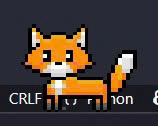
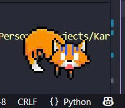

<div align="center">
    <h1>【 Karu the Fox 🦊 】</h1>
</div>

---

<div align="center">
    
    
    
</div>

---

Karu is a friendly and entertaining virtual desktop pet. Built with Python and PySide6, Karu can chat with you, play music, help you focus with its built-in Pomodoro, and react to your interaction.

---

## 📸 Preview

<div align="center">
    <a href="https://www.youtube.com/watch?v=LDVFWf0XFPM" target="_blank">
        
    </a>
    <p><i>Click the thumbnail above to view Live Demo (YouTube)</i></p>
</div>

<div align="center">
    
    
</div>

---

## ✨ Features

* **Desktop Animations:** Karu doesn't just sit there—it walks, sleeps, pauses, and reacts to being dragged around.
* **Interactive AI Chat:** Have a real conversation with Karu, powered by the Google Gemini API. Karu has a unique, supportive, and slightly sassy personality.
* **Built-in Music Player:** A sleek, self-contained music player that scans your local `assets/music/` folder and remembers your volume and song settings.
* **Pomodoro Timer:** Stay productive with Karu's built-in Pomodoro timer, complete with customizable work and break intervals.
* **System Tray Menu:** A right-click system tray icon gives you quick access to all of Karu's features, including the chat, music player, and exit button.

---

## 💻 Technology Stack

* **Python 3**
* **PySide6** (Qt for Python) - *Application framework and UI*.
* **Google Gemini API** - *AI-powered chat functionality*.

---

## 🚀 Getting Started

Follow the following steps to set up and run the project on your local machine.

### 1. Prerequisites

Make sure you have **Python 3.10** or newer installed. For more information, visit the [official Python Docs](https://wiki.python.org/moin/BeginnersGuide/Download) and the [official Python Downloads page](https://www.python.org/downloads/).

### 2. Clone the Repository

```bash
git clone https://github.com/your-username/karu-the-fox.git
cd Karu-the-Fox
```

### 3. Set Up a Virtual Environment

It's highly recommended to use a virtual environment.

* **For Windows:**

    ```bash
    python -m venv .venv
    .venv\Scripts\activate
    pip install -r requirements.txt
    ```

* **For MacOS / Linux:**

    ```bash
    python3 -m venv .venv
    source .venv/bin/activate
    pip install -r requirements.txt
    ```

### 4. Configure the API key

This project uses the Gemini API, which requires a secret key.

1. Copy the example `.env` file to create your own:

    ```bash
    # On Windows (Command Prompt)
    copy .env.example .env
    
    # On macOS/Linux
    cp .env.example .env
    ```

2. Open the new `.env` file (it's hidden by default) in a text editor.
3. Go to [Google AI Studio](https://aistudio.google.com/app/apikey).
4. Navigate to **Dashboard** > **API Keys** and create a new API key if you don't already have one.
5. Paste your key into the `.env` file:

    ```bash
    # .env
    GEMINI_API_KEY=YOUR_API_KEY_GOES_HERE
    ```

### 5. (Optional) Add Your Music

The music player scans audio files placed directly in `assets/music/`.

**Supported formats:** `.mp3`, `.wav`, `.m4a`

***About Album art:*** Embedded art in the file is used when available. If no art is found, the `assets/images/music-player/no-art-found.png` placeholder is used.

**Example directory structure:**

``` bash
Karu-the-Fox/
│
├── assets/
│   ├── fonts/
│   ├── images/
│   ├── music/
│   │   ├── track1.mp3
│   │   ├── track2.wav
│   │   ├── track3.m4a
│   │   └── ...
│   └── sounds/
│
├── previews/
├── src/
├── config.json
├── main.py
├── requirements.txt
├── .env
└── .env.example
```

### 6. Run the App

You're all set! Launch the application by running:

```bash
python main.py
```

---

## 📂 Directory Structure

Here's a quick overview of the project's layout:

``` bash
Karu-the-Fox/
│
├── assets/             # App assets
│   ├── fonts/          # Bundled fonts (NerdFontSymbolsOnly for chat icons)
│   ├── images/         # App icons, fox sprites, UI art
│   │   ├── fox/
│   │   ├── hydration-exercises/
│   │   ├── music-player/
│   │   ├── others/
│   │   └── pomodoro/
│   ├── music/          # Folder for your music (see above)
│   └── sounds/         # SFX for interactions
│
├── previews/           # Preview images and thumbnails
├── src/                # Application source code
│   ├── __init__.py
│   ├── chat.py         # Chat window UI and API logic
│   ├── constants.py    # Manages all file paths
│   ├── desktop_pet.py  # The core DesktopPet class and logic
│   ├── music_player.py # The music player UI and logic
│   ├── onboarding.py   # Speech bubble and dialog classes
│   └── pomodoro.py     # Pomodoro timer UI and logic
│
├── config.json         # Stores settings
├── main.py             # The main entry point for the app
├── requirements.txt    # Python dependencies
├── .env                # Your secret API key
└── .env.example        # API key template
```

---

## 📄 License

This project is licensed under the MIT License. See [LICENSE](./LICENSE) for more details.
