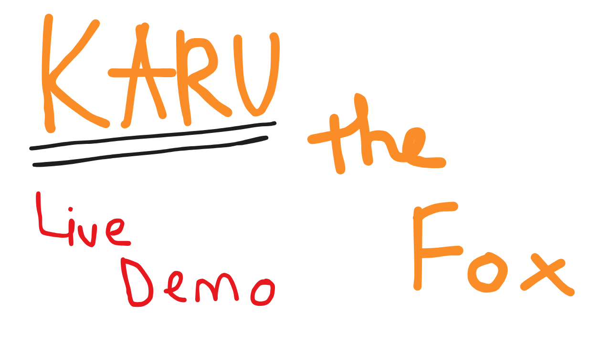
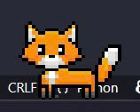
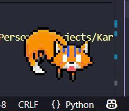

# Karu the Fox 🦊

Karu is a clever and friendly virtual desktop pet . Built with Python and PySide6, Karu can chat with you, play music, and react to your presence.

---

## 📸 Preview

<div align="center">
    <a href="https://www.youtube.com/watch?v=LDVFWf0XFPM" target="_blank">
        
    </a>
    <p><i>Click the thumbnail above to view Live Demo (YouTube)</i></p>
</div>

<div align="center">
    
    
</div>

---

## ✨ Features

* **Interactive AI Chat:** Have a real conversation with Karu, powered by the Google Gemini API. Karu has a unique, supportive, and slightly sassy personality.
* **Built-in Music Player:** A sleek, self-contained music player that scans your local `assets/music/` folder and remembers your volume and song settings.
* **Dynamic Onboarding:** On first launch, Karu greets you and asks about your day with a simple mood survey.
* **Desktop Animations:** Karu doesn't just sit there—it walks, sleeps, pauses, and reacts to being dragged around.
* **System Tray Menu:** A right-click system tray icon gives you quick access to all of Karu's features, including the chat, music player, and exit button.

---

<!-- ## 🖼️ Screenshots

*(Replace these with actual screenshots of your app)*

| Chat Window | Music Player |
| :---: | :---: |
| `` | `` |

--- -->

## 💻 Technology Stack

* **Python 3**
* **PySide6** (Qt for Python) - *Application framework and UI*.
* **Google Gemini API** - *AI-powered chat functionality*.

---

## 🚀 Getting Started

Follow these steps to set up and run the project on your local machine.

### 1. Prerequisites

Make sure you have **Python 3.10** or newer installed.

### 2. Clone the Repository

```bash
git clone https://github.com/your-username/karu-the-fox.git
cd Karu-the-Fox
```

### 3. Set Up a Virtual Environment

It's highly recommended to use a virtual environment.

* **For Windows:**

    ```bash
    python -m venv venv
    venv\Scripts\activate
    pip install -r requirements.txt
    ```

* **For MacOS / Linux:**

    ```bash
    python3 -m venv .venv
    source venv/bin/activate
    pip install -r requirements.txt
    ```

### 4. Configure the API key

This project uses the Gemini API, which requires a secret key.

1. Copy the example `.env` file to create your own:

    ```bash
    # On Windows (Command Prompt)
    copy .env.example .env
    
    # On macOS/Linux
    cp .env.example .env
    ```

2. Open the new `.env` file (it's hidden by default) in a text editor.
3. Go to [Google AI Studio](https://aistudio.google.com/app/apikey).
4. Navigate to **Dashboard** > **API Keys** and create a new API key if you don't already have one.
5. Paste your key into the `.env` file:

    ```bash
    # .env
    GEMINI_API_KEY=YOUR_API_KEY_GOES_HERE
    ```

### 5. (Optional) Add Your Music

The music player scans the `assets/music/` folder. For the app to find your songs, you must follow a specific folder structure:

```
assets/music/
│
├── My-Favorite-Song/
│    ├── My-Favorite-Song_Author-Name.mp3
│    └── thumbnail.jpg
│
└── Another-Song/
     ├── Another-Song_Author-Name.mp3
     └── thumbnail.png
```

***Example:***

```
assets/music/
│
├── Interstellar-Main-Theme/
│    ├── Interstellar-Main-Theme_Hans-Zimmer.mp3
│    └── thumbnail.jpg
│
└── Nang-Tho/
     ├── Nang-Tho_Hoang-Dung.mp3
     └── thumbnail.png
```

**Notes:**
*- Each song **must** be in its own sub-folder.*
*- The app will look for the first `.mp3` file in provided sub-folder.*
*- The app will look for a `thumbnail.jpg`, `thumbnail.png`, or `thumbnail.jfif` file for the album art.*

### 6. Run the App

You're all set! Launch the application by running:

```bash
python main.py
```

---

## 📂 Directory Structure

Here's a quick overview of the project's layout:

```
Karu-the-Fox/
│
├── .env                # Your secret API key
├── .env.example        # API key template
├── config.json         # Stores music player settings
├── main.py             # The main entry point for the app
├── requirements.txt    # Python dependencies
│
├── assets/
│   ├── images/         # All app icons and fox animations
│   └── music/          # Folder for your music (see setup)
│
└── src/                # All application source code
    ├── __init__.py
    ├── chat.py         # Chat window UI and API logic
    ├── constants.py    # Manages all file paths
    ├── desktop_pet.py  # The core DesktopPet class and logic
    ├── music_player.py # The music player UI and logic
    └── onboarding.py   # Speech bubble and dialog classes
```

---

## 📄 License

This project is licensed under the GNU General Public License v3.0. See [LICENSE](./LICENSE) for more details.
